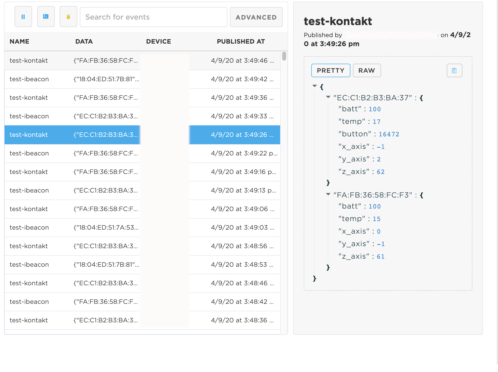

# Beacon Scanner

This library works with Particle Gen3 devices to scan for BLE advertisements and parses them for common beacon standards. Currently supported:
* iBeacon
* Kontakt.io beacons (tested with Asset Tag S18-3)

## Functions available

There are a few functions that an application can call depending on the needs of the use case.

### Automatic Scan and Publish

In this mode, the library will scan for BLE advertisements, and use Particle.publish() to send the data to the cloud.

    
    void scanAndPublish(uint16_t duration, int flags, const char* eventName, PublishFlags pFlags)

    duration: How long to collect data, in seconds
    flags: Which type of beacons to publish. Use bitwise OR for multiple. e.g.: SCAN_KONTAKT | SCAN_IBEACON
    eventName: The cloud publish will use this event name, and add "-ibeacon" or "-kontakt"
    pFlags: Flags for the publish, e.g.: PRIVATE

The output of this on the console looks like (with eventName "test"):

### Get a Vector of the detected tags

If the application needs to get the data, rather than automatically publishing it, this can be accomplished by first running a scan using the following function:

    void scan(uint16_t duration, int flags)

    duration: How long to collect data, in seconds
    flags: Which type of beacons to publish. Use bitwise OR for multiple. e.g.: SCAN_KONTAKT | SCAN_IBEACON

There are two convenience function calls as well:

    void scan(uint16_t duration)     // Scans for all supported advertisers for the duration in seconds
    void scan()                      // Scans for all supported advertisers for the default of 5 seconds

And then the data for each supported type of advertiser can be retrieved as a Vector:

    Vector<KontaktTag> getKontaktTags();
    Vector<iBeacon> getiBeacons();

### A note on "duration"

This is how long the library will listen for beacons. However, during that time a beacon might advertise multiple times. The library will NOT publish every time the beacon advertises.

For a Kontakt tag, all the values will be based on the last received packet for each address detected.

For an iBeacon, all the values will be based on the last received packet except for RSSI. The RSSI will be an average of all the received values during the scan duration.

## Typical usage

    #include "Particle.h"
    #include "BeaconScanner.h"

    SYSTEM_THREAD(ENABLED);

    Beaconscanner scanner;

    void setup() {
    }

    unsigned long scannedTime = 0;

    void loop() {
        if (Particle.connected() && (millis() - scannedTime) > 10000) {
            scannedTime = millis();
            scanner.scanAndPublish(5, SCAN_KONTAKT | SCAN_IBEACON, "test", PRIVATE);
        }
    }

## Examples

* __Log:__ Starts a scan for iBeacons and Kontakt tags, and then logs the address, major, and minor of the beacons, and the address and temperature of the tags
* __Publish:__ Starts a scan which publishes iBeacons and Kontakt tags
